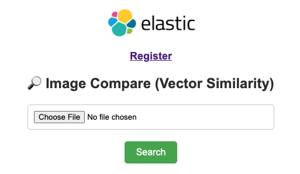
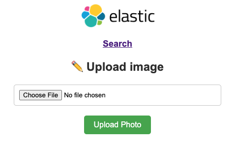

# FACE RECGONITION APP (Elastic Vector Search)

### Environment

Python 3.12.3

### HOW TO

* First you need to create the index mapping:

```json
{
  "search_project": {
    "mappings": {
      "properties": {
        "description": {
          "type": "keyword"
        },
        "face_vector": {
          "type": "dense_vector",
          "dims": 128,
          "index": true,
          "similarity": "l2_norm"
        },
        "image_base64": {
          "type": "text"
        }
      }
    }
  }
}
```

* Next step, edit the **connection.txt** file with Elasticsearch endpoint, user and password!

* Now you need to install the requirements:

`$ pip install requirements.txt`

* After that you will be able to run the app:

`$ python app.py`

* Access http://localhost and you need to see this page:



BUT, you need to upload some images before searching! 😅 

* Click **Register** and you will be redirect to another page, here you can uploading your images.



## ENJOY YOUR FACE RECOGNITION APP
